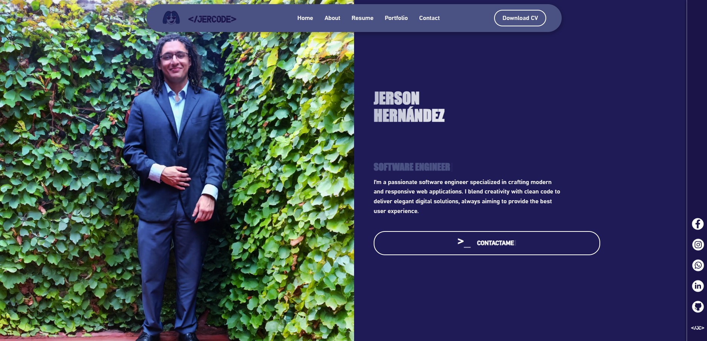
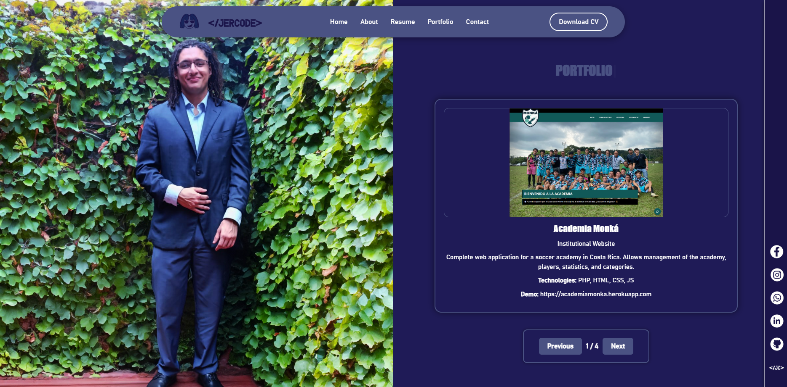
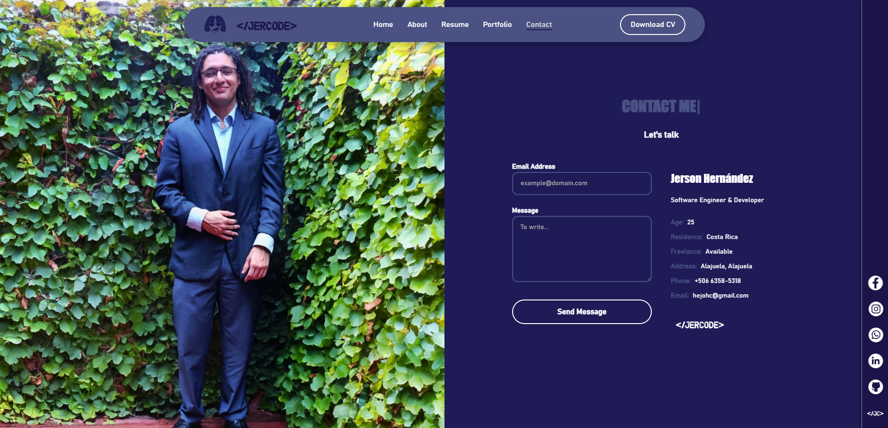

# 🌐 Personal Portfolio | Portafolio Personal

A modern, responsive and bilingual (EN/ES) portfolio built with React, CSS, and Formspree for contact form handling.

Un portafolio moderno, responsivo y bilingüe (EN/ES) desarrollado con React, CSS y Formspree para el manejo del formulario de contacto.

---

## 🔍 Features | Características

- ✅ Responsive Design (Desktop, Tablet, Mobile)
- 🧠 Typewriter animation for section titles
- 📁 Portfolio with image carousel
- 📄 Resume section with experience, education, and skills
- 📬 Contact form with email sending via Formspree
- 🌙 Dark-themed aesthetic
- 🇪🇸🇺🇸 Bilingual interface

---

## 🚀 Tech Stack | Tecnologías

- React.js
- HTML5 / CSS3
- Formspree (for sending emails)
- Vercel (deployment)

---

## ✉️ Contact | Contacto

- **Email:** hejohc@gmail.com  
- **Phone:** +506 6358-5318  
- **Location / Ubicación:** Alajuela, Costa Rica

---

## 📸 Screenshots | Capturas






---

## 📦 Deployment | Despliegue

This project is hosted on [Vercel](https://vercel.com/).  
Este proyecto está alojado en [Vercel](https://vercel.com/).

To deploy your own version:

```bash
npm install
npm run build